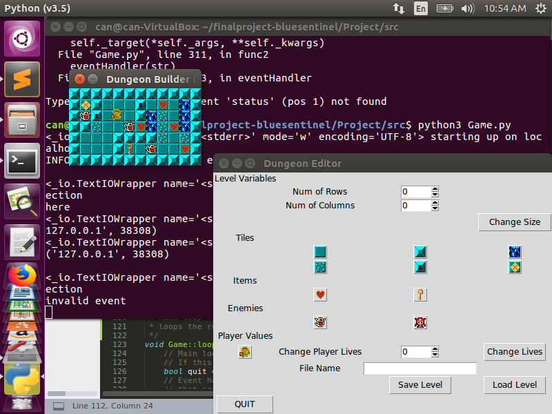
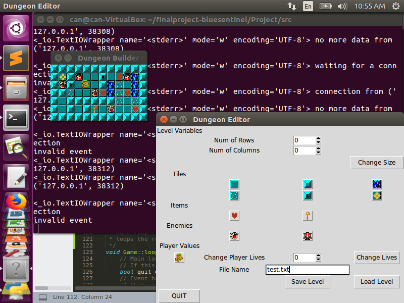

# Dungeon Editor Final Project by Blue Sentinel

## Download

[Click here to download!](DOWNLOADLINK)

## Documentation
[Click here for documentation](DOCUMENTATIONLINK)

## Gameplay Trailer

<iframe width="560" height="315" src="https://www.youtube.com/embed/St1GVpsi2rY" frameborder="0" allow="accelerometer; autoplay; encrypted-media; gyroscope; picture-in-picture" allowfullscreen></iframe>

## Screenshots

## Final Project Post Mortem

Overall we were plagues with lots of different issues when starting out. Initially due to our lack of familiarity with GUI in general we had no idea where to start. From there we looked into several options but unfortunetly this took more time than expected. Eventually we settled on python using tkinter. Even after figuring out the GUI we still had many issues with getting the labraries (especially pybind11 set up). Overall most of our struggles over the course of the project came from the actuall setting up of the project.

With an additional 8 weeks I believe we could make an amazing dungeon maker, we could implement all of our other mechanics and functionality. Since it's just the two of us we would do a much better time managing our tasks and and keeping to deadlines. I would I also have liked to have looked deeper into tkinter's GUI settings. With more time we could have also experimented more with pybind11 as well as the general structure of our code. 

On the whole I would have liked to have more time to actually do the project after having set up our build scripts and libraries, those steps simply took up way to much time for us to be able to reasonably accomlish all the other tasks we had originally planned. Now that we have a better grasp on them I believe we would be able to better manage this project as a whole.

## Diagram

	Client.py               --------->        Game.py
	(contains the GUI                         (contains two threads)
	widgets and sends                          |              |
	corresponding signals                      v              v
	 into the socket)                        thread1         thread2
	                                           |                |
	                                           v                v
	                               (listens for signals         (contains the main game loop,
	                               within the socket then         uses pybind to call C++ 
	                               calls the corresponding        functions to render the
	                               functions)                     various entities in the
	                                                              game, this contains the entities themselves and manages their variables)
	                                                                         |
	                                                                         |
	                                                                         v
	                                                                     Game.cpp
	                                                                (C++ code in charge of reading from files and rendering the tiles, enemies, items, and the player, is also in charge of saving current entity locations to new txt files)

### Blue Sentinel
- Can "Turk" Bekcioglu
- Riley Nolan
